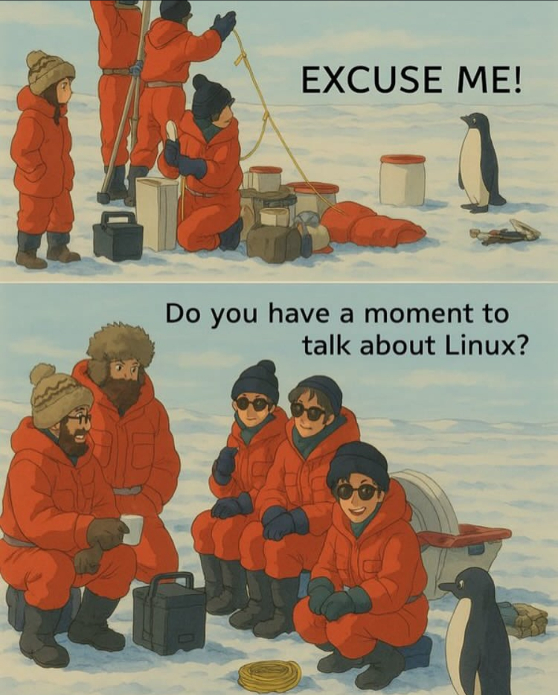

<h1 align="left"> Hey there, I'm Mann 👋 </h1>

      
<!--     -->
   
   

<h3 align="left">I'm a Computer Science student passionate about full-stack development, Software Engineering, and I use Fedora btw</h3>

<!--  -->

<!-- credits for gif https://gph.is/g/ZWg5jr7 -->

